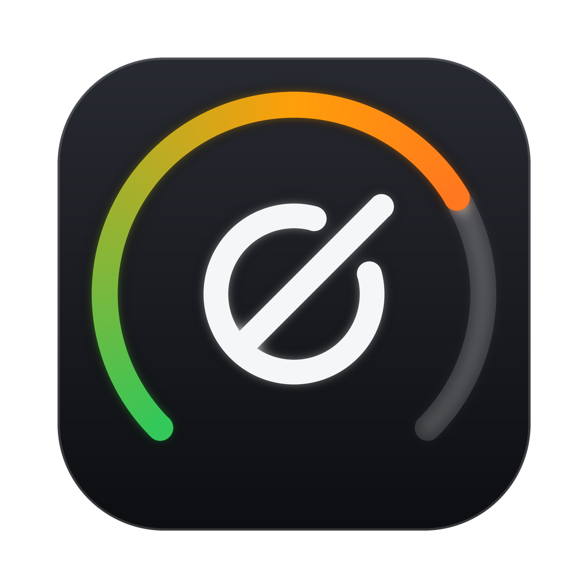
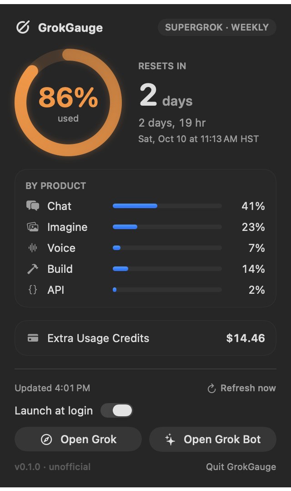
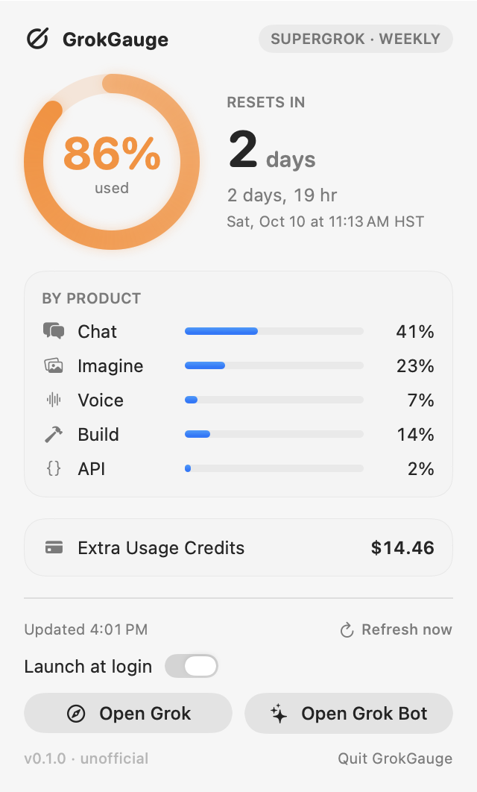

<p align="center">
  
</p>

<h1 align="center">GrokGauge</h1>

<p align="center">
  Your SuperGrok usage, at a glance, in the macOS menu bar.<br>
  <sub>Native Swift · macOS 14+ · Apple silicon &amp; Intel · MIT licensed</sub>
</p>

<p align="center">
  
</p>

> **Unofficial.** GrokGauge is a community project by [retroCombs](https://www.retrocombs.com).
> It is not made, endorsed, or supported by xAI. "Grok" and "SuperGrok" are trademarks of xAI.

## What it does

SuperGrok plans share **one usage pool** across Chat, Imagine, Voice, Build, and the API, and
that pool resets **every 7 days** on your account's own schedule. GrokGauge keeps the number in
view so you're never surprised:

- **Menu bar meter.** A small Grok-style glyph plus the percent of the pool you've used, color-coded:
  **green** up to 80%, **orange** from 81–90%, **red** above 90%.
- **Ring gauge dropdown.** Days until reset, a live countdown, and the exact reset day and time in your time zone.
- **Per-product breakdown.** How much of the pool went to Chat, Imagine, Voice, Build, and API.
- **Extra Usage Credits.** Your prepaid credit balance (and on-demand spend, if you've enabled it).
- **Heads-up notifications** once per period when you cross 80% and 90%.
- **Refresh now**, last-updated time, and automatic refresh every 15 minutes (and after wake).
- **Launch at login** toggle (uses macOS's built-in Login Items).
- **Open Grok** (grok.com in your default browser) and **Open Grok Bot** (if installed) right from the menu.

<p align="center">
  
  &nbsp;&nbsp;
  
</p>
<p align="center"><sub>Screenshots use sample data.<!-- TODO: replace with a real menu bar screenshot --></sub></p>

## Requirements

- macOS 14 Sonoma or later
- A SuperGrok subscription
- The **Grok CLI** (Grok Build), signed in once:

  ```sh
  grok login
  ```

  GrokGauge reads the login the CLI saves in `~/.grok/auth.json`. It never signs in or refreshes
  tokens by itself. If the login expires, the menu shows **"Run `grok login` to reconnect."**
  Using the Grok CLI normally keeps the login fresh.

## Install

### Homebrew

```sh
brew install --cask stevencombs/tap/grokgauge
```

### Manual

1. Download `GrokGauge-<version>.zip` from the [latest release](https://github.com/stevencombs/GrokGauge/releases/latest).
2. Unzip it and drag **GrokGauge.app** into `/Applications` (or `~/Applications`).
3. Open it. Look for the gauge in your menu bar.

GrokGauge releases are ad-hoc signed, not notarized by Apple. If macOS says the app can't be
opened, either right-click it and choose **Open**, allow it under **System Settings › Privacy &
Security**, or run:

```sh
xattr -dr com.apple.quarantine /Applications/GrokGauge.app
```

### Using it on several Macs

Install GrokGauge and run `grok login` on each Mac. Settings are per-Mac; there's nothing to sync.

## Privacy

- Your Grok token **never leaves your Mac** except in the one HTTPS request GrokGauge makes to
  xAI's usage endpoint (`cli-chat-proxy.grok.com`). It goes nowhere else.
- GrokGauge only **reads** `~/.grok/auth.json`. It never writes, copies, logs, or refreshes the token.
- Requests use an ephemeral session (no cookies, no cache) and refuse redirects, so the token
  can't be forwarded to another host.
- No analytics, no telemetry, no third-party servers.

## How it works (and the fine print)

GrokGauge calls the same **unofficial** billing endpoint the Grok CLI uses for its `/usage` view:

```
GET https://cli-chat-proxy.grok.com/v1/billing?format=credits
Authorization: Bearer <token from ~/.grok/auth.json>
```

and reads `config.creditUsagePercent`, `config.currentPeriod`, `config.productUsage`, and the credit
balances. xAI doesn't document this endpoint and can change it at any time, which could break
GrokGauge until it's updated. When xAI omits `creditUsagePercent` (it does right after a reset,
since zero values are dropped), GrokGauge shows 0%.

Want the raw numbers? Run the app binary with a debug flag. It never prints your token:

```sh
/Applications/GrokGauge.app/Contents/MacOS/GrokGauge --print-usage   # or --json
```

## Build from source

You only need the Xcode **Command Line Tools** (`xcode-select --install`); the full Xcode app is optional.

```sh
git clone https://github.com/stevencombs/GrokGauge.git
cd GrokGauge
./scripts/test.sh            # unit tests
./scripts/build-app.sh       # -> dist/GrokGauge.app and dist/GrokGauge-<version>.zip
open dist/GrokGauge.app
```

`build-app.sh` compiles a universal (arm64 + x86_64) release binary with Swift Package Manager,
assembles the `.app` bundle, ad-hoc signs it, and zips it. Set `ARCHS=arm64` for an Apple
silicon-only build, or `CODESIGN_IDENTITY="Developer ID Application: …"` to sign with your own
certificate.

### Releasing

1. Bump `VERSION`, commit, then tag: `git tag v0.1.0 && git push --tags`.
2. The **Release** GitHub Action builds the universal app and attaches `GrokGauge-<version>.zip`
   (and its `.sha256`) to a GitHub release.
3. Copy `Casks/grokgauge.rb` into the `stevencombs/homebrew-tap` repo, then update `version` and `sha256`.

### Project layout

```
Sources/GrokGaugeCore/   auth.json reading, the billing request, JSON parsing (Foundation only)
Sources/GrokGauge/       menu bar app (AppKit + SwiftUI), notifications, login item, debug CLI
Tests/                   swift-testing unit tests
scripts/                 build-app.sh, test.sh, assets/make-icon.py
Resources/               Info.plist template, AppIcon.icns
Casks/grokgauge.rb       Homebrew cask template for the tap
```

## Credits

Endpoint details were cross-checked against the open-source
[pi-grok-usage](https://github.com/apoapostolov/pi-grok-usage),
[CodexBar](https://github.com/steipete/CodexBar), and
[OmniRoute](https://github.com/diegosouzapw/OmniRoute) projects. The GrokGauge glyph is an original
drawing and isn't xAI's logo.

## License

[MIT](LICENSE) © 2026 Steven Combs (retroCombs)
