<p align="center">
  
</p>

<h1 align="center">GrokGauge</h1>

<p align="center">
  Your SuperGrok and Grok Bot usage, at a glance, in the macOS menu bar.<br>
  <sub>Native Swift · macOS 14+ · Apple silicon &amp; Intel · MIT licensed</sub>
</p>

<p align="center">
  
</p>

> **Unofficial.** GrokGauge is a community project by [retroCombs](https://www.retrocombs.com).
> It is not made, endorsed, or supported by xAI, or by Anysphere, the maker of the Grok Bot app.
> "Grok" and "SuperGrok" are trademarks of xAI. GrokGauge reads undocumented data sources that
> can change without notice.

## What it does

GrokGauge tracks two weekly limits side by side:

- **Grok.** SuperGrok plans share **one usage pool** across Chat, Imagine, Voice, Build, and the
  API. It resets **every 7 days** on your account's own schedule.
- **Grok Bot.** If you use the [Grok Bot](https://cursor.com/bot) desktop app, its **weekly usage**
  (the number on Grok Bot's *Settings › Usage & Billing* screen) has its own limit and its own reset time.

Features:

- **Menu bar meter.** A small Grok-style glyph plus a percent, color-coded **green** up to 80%,
  **orange** from 81–90%, and **red** above 90% (levels and colors are yours to change). Show the
  **higher** of the two numbers, **both** (`G 42% · B 86%`), just one source, or only the logo tinted
  by status. Optionally add the days to reset (`10% · 5d`) or hide the logo.
- **Ring gauges** for Grok and Grok Bot: side by side, stacked, or one combined ring showing the higher.
- **History & pace.** A 7-day graph for each source: one bar per day with the highest % reached that day
  (or a line or area graph, your pick), plus a projection: "On track (≈40% at reset)"
  or "At this pace you'll hit 100% by Fri 3 PM".
- **Reset times.** Days until reset, a live countdown, and the exact reset day and time in your
  time zone. When Grok and Grok Bot reset at different times you get one clearly labeled line for each.
- **Per-product breakdown** of the Grok pool: Chat, Imagine, Voice, Build, and API.
- **Extra Usage Credits.** Your prepaid Grok credit balance (and on-demand spend, if you've enabled it).
- **Heads-up notifications** when Grok or Grok Bot enters the warning and critical levels, once per week for each.
- **Refresh now**, last-updated time, automatic refresh every 5–60 minutes, and smart retries
  (backoff on errors, a quiet grace period after wake or a network change).
- **Global shortcut** (default **⌃⌥G**) to open the dropdown from anywhere.
- **Open Grok**, **Open Grok Bot** (if installed) and **Open X** (the X app if installed, otherwise x.com) buttons.
- **Settings window** (gear button or **⌘,**): reorder and hide dropdown sections, menu bar style,
  levels and colors (with a colorblind-friendly preset), notification levels, refresh interval,
  launch at login, settings sync between Macs, diagnostics, and an optional update check.
- **Accessible.** VoiceOver labels and values on the rings, bars, charts and buttons; respects
  Reduce Motion and Increase Contrast.

<p align="center">
  
  &nbsp;&nbsp;
  
</p>
<p align="center"><sub>Screenshots use sample data (Grok 42%, Grok Bot 86%).</sub></p>

<p align="center">
  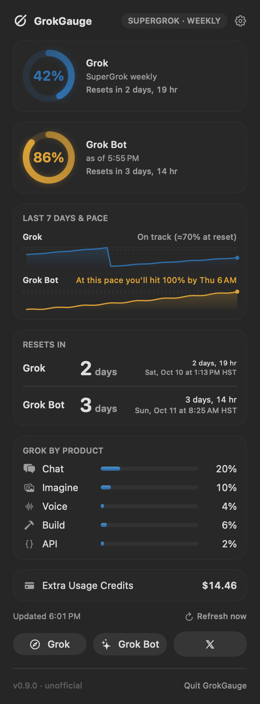
  &nbsp;
  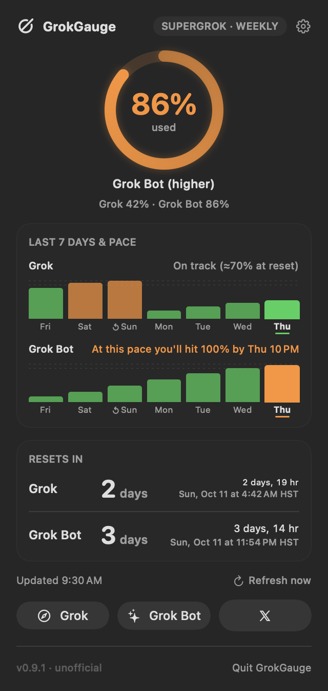
  &nbsp;
  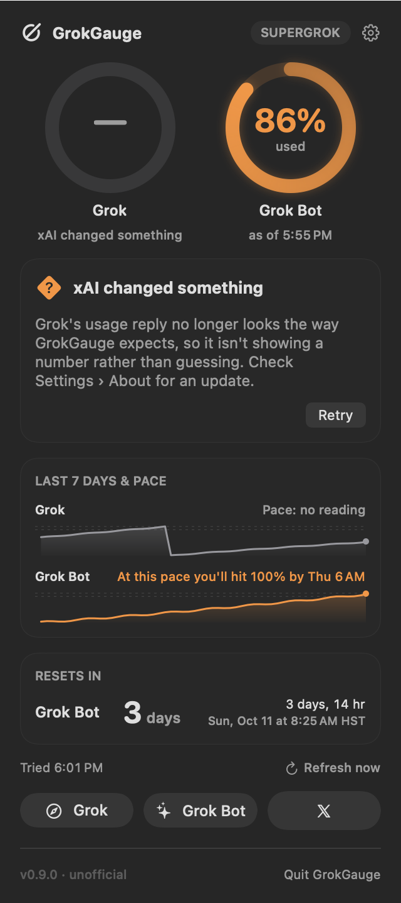
</p>
<p align="center"><sub>Stacked rings with the colorblind-friendly palette · one combined ring with sections hidden · what you see if xAI changes the usage reply.</sub></p>

<p align="center">
  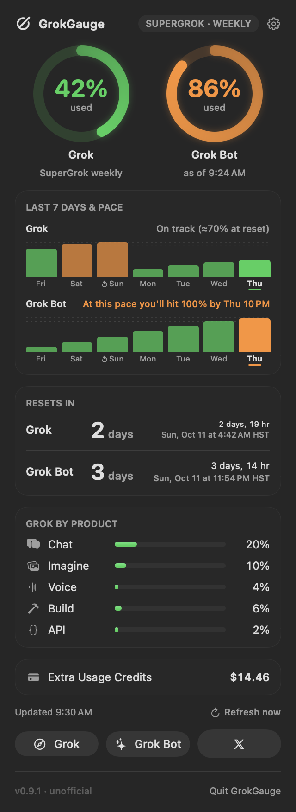
  &nbsp;
  
  &nbsp;
  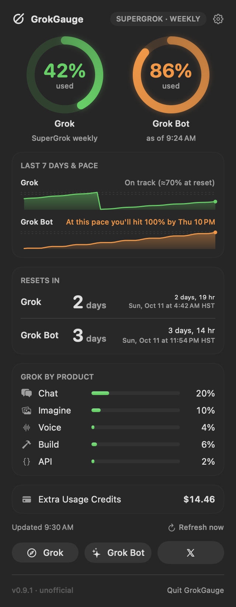
</p>
<p align="center"><sub>Graph styles: Bars (default; ↺ marks the day the week reset) · Line · Area.</sub></p>

## Requirements

- macOS 14 Sonoma or later
- A SuperGrok subscription
- The **Grok CLI** (Grok Build), signed in once:

  ```sh
  grok login
  ```

  GrokGauge uses the login the CLI saves in `~/.grok/auth.json` and **renews it automatically**
  the same way the CLI does, so you stay signed in without running `grok login` again. You only
  need to sign in again if xAI revokes the login (for example after a password change or
  "sign out everywhere"); the menu then shows **"Run `grok login` to reconnect."**
- *Optional:* the **Grok Bot** desktop app, signed in. GrokGauge shows the Grok Bot ring only
  when Grok Bot is installed.

## Install

### Homebrew (recommended)

```sh
brew install --cask stevencombs/tap/grokgauge
```

This installs **GrokGauge.app** into `/Applications`. Update it with `brew upgrade --cask grokgauge`.
Remove it with `brew uninstall --cask grokgauge` (add `--zap` to also delete its preferences).

GrokGauge is ad-hoc signed, not notarized by Apple. So that macOS doesn't block the first launch,
the cask ([stevencombs/homebrew-tap](https://github.com/stevencombs/homebrew-tap)) removes the
download quarantine flag from `GrokGauge.app`, and only that app, right after installing it.

### Manual

1. Download `GrokGauge-<version>.zip` from the [latest release](https://github.com/stevencombs/GrokGauge/releases/latest).
2. Unzip it and drag **GrokGauge.app** into `/Applications` (or `~/Applications`).
3. Open it. Look for the gauge in your menu bar.

GrokGauge releases are ad-hoc signed, not notarized by Apple, so the first time you open a
manually downloaded copy, macOS says it can't verify the app. Either:

- open **System Settings › Privacy & Security**, scroll down, and click **Open Anyway** next to
  GrokGauge (recent macOS versions no longer offer a right-click **Open** bypass), or
- remove the quarantine flag in Terminal:

  ```sh
  xattr -dr com.apple.quarantine /Applications/GrokGauge.app
  ```

Each release lists the zip's SHA-256 so you can check your download with `shasum -a 256`.

### First run

1. Click the gauge in the menu bar (or press **⌃⌥G**) to open the dropdown.
2. When macOS asks, **allow notifications** so you get the warning and critical alerts.
3. Click the **gear** (or press **⌘,**) and turn on **Launch at login** under *Colors & Alerts*
   if you want GrokGauge to start with your Mac.
4. Use **Refresh now** any time; otherwise it updates itself every 15 minutes (adjustable).

## Settings

Open Settings with the gear button in the dropdown or **⌘,** while the dropdown is open.
Everything applies immediately.

| | |
|---|---|
| 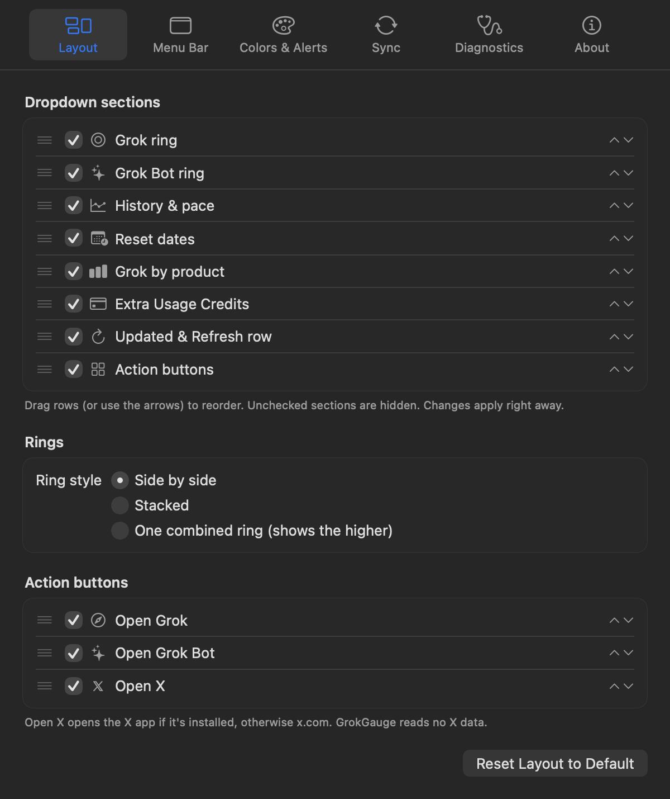 | 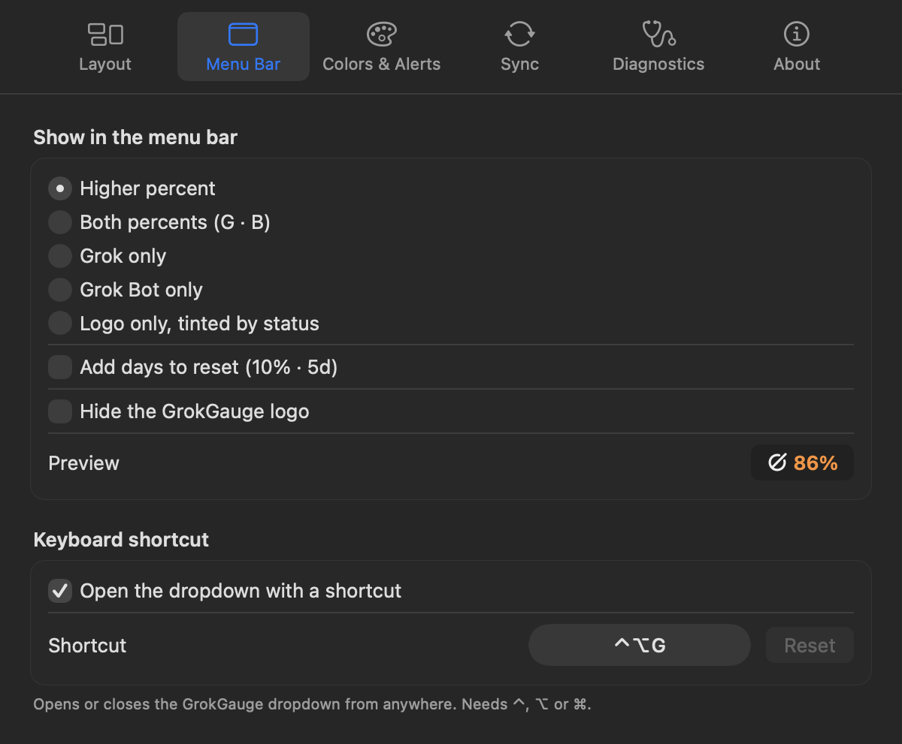 |
| 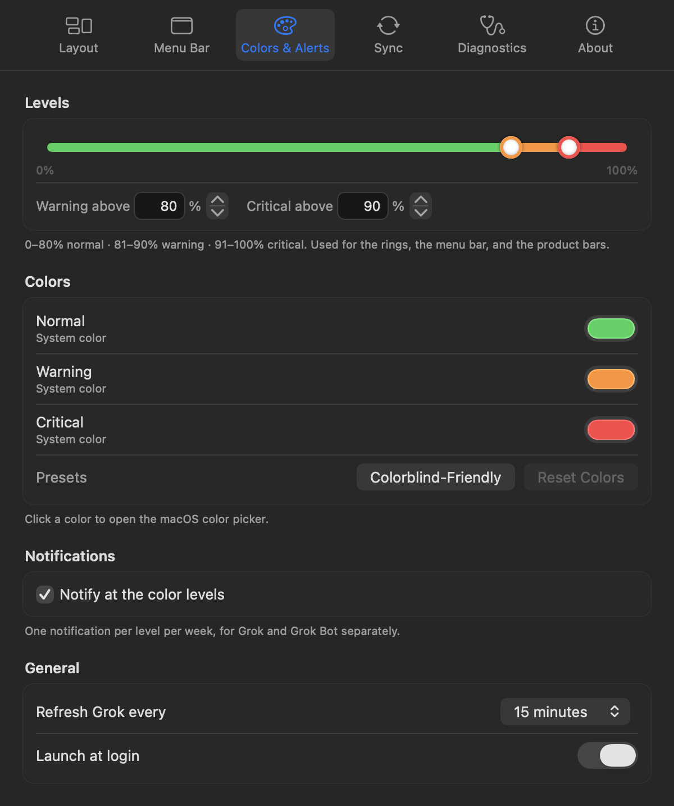 | 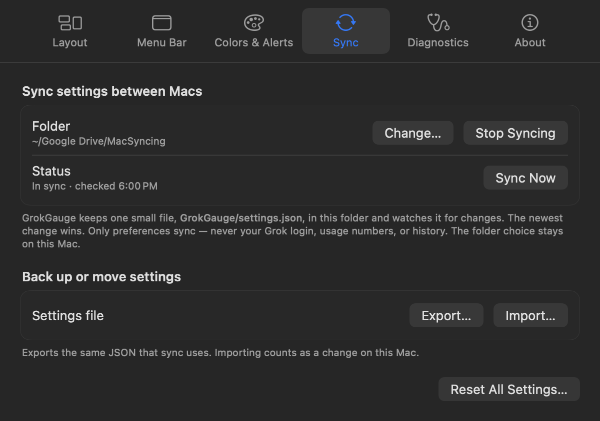 |
| 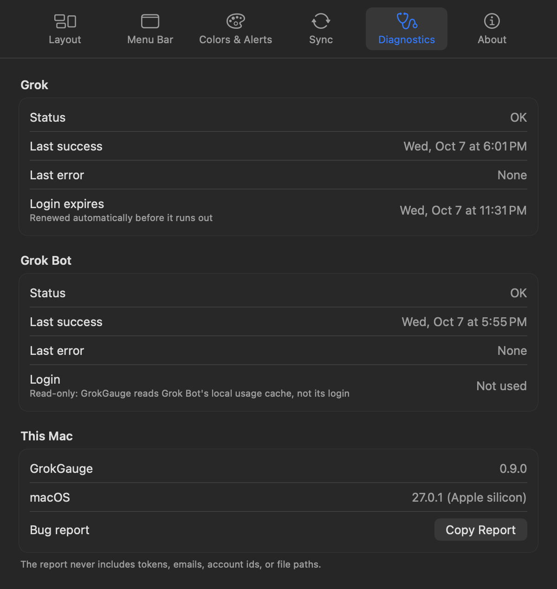 | 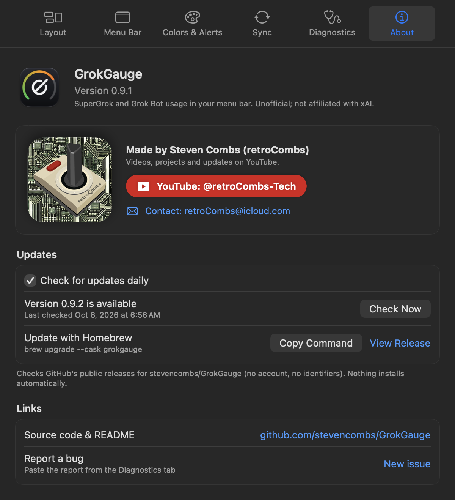 |

- **Layout.** Check or uncheck each dropdown section (Grok ring, Grok Bot ring, history & pace,
  reset dates, Grok by product, Extra Usage Credits, the Updated/Refresh row, action buttons) and drag
  rows to reorder them (the arrow buttons and VoiceOver actions work too). Under **History graphs**,
  choose whether the Grok and Grok Bot graphs appear (turning both off hides the section) and pick the
  **Graph style**: Bars (one bar per day, the default), Line, or Area. Pick the ring style, and
  choose which action buttons appear and in what order. **Reset Layout to Default** undoes it all.
- **Menu Bar.** Higher percent, both (`G · B`), Grok only, Grok Bot only, or the logo alone tinted
  green/orange/red. Optional days-to-reset suffix and a hide-the-logo switch, with a live preview.
  Set or turn off the global shortcut here; if another app already owns a combination, GrokGauge says so.
- **Colors & Alerts.** Drag the two handles of the level slider (or type the numbers) to set where
  *warning* and *critical* start; the handles can't cross and stay at least 1% apart. Pick each level's
  color with the macOS color picker; GrokGauge warns you if two colors are hard to tell apart
  (CIEDE2000 ΔE below 12) and offers a colorblind-friendly preset (Okabe–Ito blue/orange/vermilion).
  Colors apply to the rings, the menu bar percent and the product bars. Notifications follow the color
  levels unless you uncheck **Notify at the color levels** and set separate ones. Also: refresh interval
  (5, 15, 30 or 60 minutes) and **Launch at login**.
- **Sync.** See [Using it on several Macs](#using-it-on-several-macs). **Export…** and **Import…**
  save and load the same JSON file.
- **Diagnostics.** For Grok and Grok Bot: status, last success, last error (including the server's own
  error message for HTTP errors other than 401/403, with anything token-, email- or id-like removed), and (for Grok) when the
  login expires, plus the app and macOS versions. **Copy Report** puts a plain-text summary on the
  clipboard for bug reports; it never includes tokens, emails, account ids, or file paths.
- **About.** Version, who made it (with the [@retroCombs-Tech](https://www.youtube.com/@retroCombs-Tech)
  YouTube channel and a contact address), links, and **Check for updates daily** (on by default). When a newer release is
  out, the dropdown footer shows **Update available** with a link to the release and the
  `brew upgrade --cask grokgauge` command. GrokGauge never installs anything by itself.

## Using it on several Macs

Install GrokGauge and run `grok login` on each Mac (logins are never synced). To keep your
**settings** the same everywhere, open *Settings › Sync* on each Mac and choose a folder your Macs
already sync, such as a Google Drive, Insync, Dropbox or iCloud Drive folder.

- GrokGauge keeps one small file there, `GrokGauge/settings.json`, and watches it. It notices both
  in-place edits and sync clients that replace the file, and also checks every 30 seconds as a fallback.
- The newest change wins (by the time it was made). Changes made while a Mac is offline are resolved
  the same way when it comes back.
- **Only preferences sync**: layout, menu bar, levels, colors, notification levels, refresh interval,
  shortcut, and the update-check switch. Never your Grok login, tokens, usage numbers, or history.
- The folder choice itself stays on each Mac, so each one can point at its own path.

## Privacy

### Grok

- Your Grok tokens **never leave your Mac** except to two xAI hosts, over HTTPS:
  - the access token goes to xAI's usage endpoint (`cli-chat-proxy.grok.com`), and
  - the refresh token goes to xAI's sign-in server (`auth.x.ai`), only when the login needs renewing.
  They go nowhere else. GrokGauge refuses to send them to any other host.
- **GrokGauge writes to `~/.grok/auth.json`.** When it renews your login it saves the new tokens
  back into that file so the Grok CLI keeps working with them. It changes only the token fields
  of that one login (`key`, `refresh_token`, `expires_at`, `create_time`), keeps every other field
  and the file's owner-only (`0600`) permissions, and writes atomically while holding the same
  `auth.json.lock` the CLI uses, so the two never renew at the same moment.
- Tokens are never logged, printed, or copied anywhere else.
- Requests use an ephemeral session (no cookies, no cache) and refuse redirects, so tokens
  can't be forwarded to another host.

### Grok Bot

- GrokGauge **makes no network requests for Grok Bot** and uses **no Grok Bot token, password, or
  Keychain item**. It never sends Grok Bot data anywhere.
- It only **reads** two small files that Grok Bot itself writes, both inside
  `~/Library/Application Support/Grok Bot/sand-client-persistence/`:
  - the signed-in account marker (storage key `sand.client.slice.client-meta.account-slot`), and
  - that account's weekly-usage cache (storage key
    `sand.client.slice.account.<account>.weekly-usage.cache`): the percent used, the next reset
    time, and when Grok Bot last checked.

  Grok Bot names each file after its storage key (base32-encoded, plus `.blob`). Neither file
  contains a credential.
- GrokGauge never writes to, renames, or deletes anything in Grok Bot's folder. It doesn't touch
  Grok Bot's login or its encrypted secrets (`sand-secrets.json` and the "Grok Bot Safe Storage"
  Keychain item), and it never talks to Grok Bot's servers.

### Settings, history, and updates

- **Settings sync** writes only `GrokGauge/settings.json` in the folder you choose, containing
  preferences only (no tokens, emails, ids, usage, or history). Nothing is synced until you pick a folder.
- **History** for the graphs stays on your Mac in
  `~/Library/Application Support/GrokGauge/history.json`: timestamps and percents only, pruned after
  8 days, never synced or sent anywhere.
- **Update check** (optional, daily) asks GitHub's public API for the latest
  [stevencombs/GrokGauge](https://github.com/stevencombs/GrokGauge/releases) release. It's unauthenticated
  and sends no identifiers besides a `GrokGauge/<version>` User-Agent.
- **Open X** just opens the X app or x.com. GrokGauge reads no X data.

### Everything

- No analytics, no telemetry, no third-party servers.

## How it works (and the fine print)

GrokGauge calls the same **unofficial** billing endpoint the Grok CLI uses for its `/usage` view:

```
GET https://cli-chat-proxy.grok.com/v1/billing?format=credits
Authorization: Bearer <token from ~/.grok/auth.json>
```

and reads `config.creditUsagePercent`, `config.currentPeriod`, `config.productUsage`, and the credit
balances. xAI doesn't document this endpoint and can change it at any time, which could break
GrokGauge until it's updated.

- When xAI omits `creditUsagePercent` but the rest of the reply looks normal (it does this right
  after a reset, since zero values are dropped), GrokGauge shows 0% and labels the ring
  **"Inferred (none reported)"**.
- If the reply is JSON but no longer has the expected shape (no `config`, no current period), GrokGauge
  shows **"xAI changed something"** and a dash instead of a misleading 0%, and keeps retrying.
- Each refresh opens its own connection. A 400, 408, 421 or 5xx reply, or a dropped connection, is retried
  once right away on a new connection (a stuck server instance can't keep GrokGauge on an error), and then
  with backoff like network errors.
- Network errors are retried with exponential backoff (30 s, 1 min, 2 min, … up to 15 min). After your
  Mac wakes or switches networks, GrokGauge waits a few seconds before refreshing and retries quietly
  for a short grace period, so you don't see "You're offline" flash on wake.

### Grok Bot

The Grok Bot app checks your weekly usage with its own server and caches the result on disk (see
[Privacy](#grok-bot)). GrokGauge re-reads that cache every 2 minutes, whenever you open the
dropdown, and on every Grok refresh. That means:

- The Grok Bot number is **as fresh as Grok Bot's last check**. The ring shows "as of 4:28 PM" so
  you know how old it is (with the date, "as of Oct 7, 5:38 PM", when the reading is from an earlier day). Grok Bot updates the cache on its own schedule, and only while it's
  running. Opening Grok Bot's *Usage & Billing* screen is a quick way to get a fresh number.
- If the cached reading has expired (Grok Bot keeps it for about a day) or its week has already
  reset, the ring goes gray and says **"Open Grok Bot to update."** If Grok Bot is signed out or
  hasn't checked yet, it says **"Open Grok Bot to reconnect."** Only the Grok Bot ring changes;
  Grok keeps working.
- Percentages are rounded the same way Grok Bot rounds them (anything between 0 and 1% shows as 1%).
- Grok Bot's cache format is internal to Grok Bot and may change in a future version. If it does,
  the ring says "Couldn't read usage" until GrokGauge is updated.

### Staying signed in

Grok CLI access tokens last a few hours. GrokGauge renews the login when the access token is
within an hour of expiring, or right away if the usage endpoint rejects it, then retries the usage
request once. Renewal uses the same OpenID Connect refresh flow as the official Grok CLI
([xai-org/grok-build](https://github.com/xai-org/grok-build), `xai-grok-login`):

1. Take the CLI's lock (`~/.grok/auth.json.lock`) and re-read `auth.json`. If the CLI already
   renewed the token, use that one and stop.
2. Look up the token endpoint from `https://auth.x.ai/.well-known/openid-configuration`.
3. `POST https://auth.x.ai/oauth2/token` with `grant_type=refresh_token`, the stored
   `refresh_token`, and the stored `oidc_client_id` (plus `principal_type`/`principal_id` when present).
4. Save the new access token, the rotated refresh token (if xAI sent one), and the new expiry back
   into `auth.json`, then release the lock.

If xAI rejects the refresh token, GrokGauge stops and asks you to run `grok login`. If auth.x.ai
is just unreachable, it keeps using the current token while it's still valid and tries again later.

### Debug flags

Want the raw numbers? Run the app binary with a debug flag. None of them print your tokens:

```sh
/Applications/GrokGauge.app/Contents/MacOS/GrokGauge --print-usage   # Grok + Grok Bot; or --json
/Applications/GrokGauge.app/Contents/MacOS/GrokGauge --refresh-now   # renew the login now; prints expiry times
/Applications/GrokGauge.app/Contents/MacOS/GrokGauge --render-preview ~/Desktop/gg --demo   # dropdown, menu bar and Settings PNGs
```

## Build from source

You only need the Xcode **Command Line Tools** (`xcode-select --install`); the full Xcode app is optional.

```sh
git clone https://github.com/stevencombs/GrokGauge.git
cd GrokGauge
./scripts/test.sh            # unit tests
./scripts/build-app.sh       # -> dist/GrokGauge.app and dist/GrokGauge-<version>.zip
open dist/GrokGauge.app
```

`build-app.sh` compiles a universal (arm64 + x86_64) release binary with Swift Package Manager,
assembles the `.app` bundle, ad-hoc signs it, and zips it. Set `ARCHS=arm64` for an Apple
silicon-only build, or `CODESIGN_IDENTITY="Developer ID Application: …"` to sign with your own
certificate.

### Releasing

1. Bump `VERSION` (and `version` in `Casks/grokgauge.rb`), commit, then tag: `git tag -a v1.2.3 -m "GrokGauge 1.2.3" && git push origin v1.2.3`.
2. The **Release** GitHub Action runs the tests, builds the universal app, and attaches
   `GrokGauge-<version>.zip` (and its `.sha256`) to a GitHub release.
3. In [stevencombs/homebrew-tap](https://github.com/stevencombs/homebrew-tap), update `version`
   and `sha256` in `Casks/grokgauge.rb` (use the sha256 from the release; until then this repo's copy
   carries a placeholder), then copy that file to `Casks/grokgauge.rb` here so the two stay in sync. Check it with `brew audit --cask --strict --online stevencombs/tap/grokgauge`.

### Project layout

```
Sources/GrokGaugeCore/   auth.json + token renewal, the billing request, the Grok Bot cache reader,
                         settings model + sync, colors, pace, history, update check (Foundation only)
Sources/GrokGauge/       menu bar app (AppKit + SwiftUI), Settings window, notifications, shortcut, debug CLI
Tests/                   swift-testing unit tests
scripts/                 build-app.sh, test.sh, assets/make-icon.py
Resources/               Info.plist template, AppIcon.icns
Casks/grokgauge.rb       Copy of the cask in stevencombs/homebrew-tap
```

See [CONTRIBUTING.md](CONTRIBUTING.md) for how to contribute and [CHANGELOG.md](CHANGELOG.md) for what changed.

## Credits and contact

<p>
  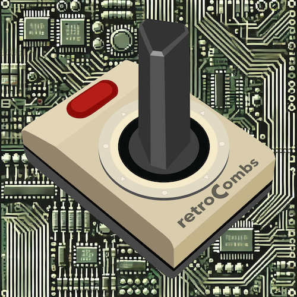
</p>

Created by **Steven Combs** (**retroCombs**) and built together with **Grok Bot**, Steven's AI assistant,
which wrote the code, tests, and docs to his spec.

- **YouTube:** [@retroCombs-Tech](https://www.youtube.com/@retroCombs-Tech)
- **Contact:** [retroCombs@icloud.com](mailto:retroCombs@icloud.com)
- **Bugs and feature requests:** [GitHub issues](https://github.com/stevencombs/GrokGauge/issues/new/choose)

The same links are in GrokGauge under **Settings › About**.
<br clear="left">


Endpoint details were cross-checked against the open-source
[pi-grok-usage](https://github.com/apoapostolov/pi-grok-usage),
[CodexBar](https://github.com/steipete/CodexBar), and
[OmniRoute](https://github.com/diegosouzapw/OmniRoute) projects. The GrokGauge glyph is an original
drawing and isn't xAI's logo.

## License

[MIT](LICENSE) © 2026 Steven Combs (retroCombs)
